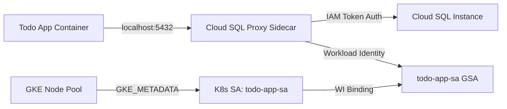

# Cloud SQL IAM Authentication Implementation

## Overview
This document describes the implementation of Cloud SQL IAM authentication for the todo-app-go application using Google Cloud Workload Identity.

## Problem Statement
The application was experiencing `CrashLoopBackOff` errors due to failed database authentication. The initial configuration attempted to use IAM authentication but was missing critical Workload Identity configuration.

## Root Cause
The GKE node pool was missing the `workload_metadata_config` setting required for Workload Identity to function. Without `mode = "GKE_METADATA"`, the Cloud SQL Proxy could not obtain IAM tokens for database authentication.

## Solution

### 1. Terraform Configuration Updates

#### Node Pool Configuration (`terraform/main.tf`)
Added Workload Identity metadata configuration to the node pool:

```hcl
resource "google_container_node_pool" "primary_nodes" {
  name       = "${google_container_cluster.primary.name}-node-pool"
  location   = var.region
  cluster    = google_container_cluster.primary.name
  node_count = 2

  node_config {
    machine_type = "e2-medium"
    service_account = google_service_account.gke_node.email
    oauth_scopes = [
      "https://www.googleapis.com/auth/cloud-platform"
    ]
    metadata = {
      disable-legacy-endpoints = "true"
    }
    workload_metadata_config {
      mode = "GKE_METADATA"  # CRITICAL: Required for Workload Identity
    }
  }
}
```

#### IAM Database User (`terraform/main.tf`)
Created Cloud SQL IAM user with truncated service account email:

```hcl
resource "google_sql_user" "iam_user" {
  name     = replace(google_service_account.todo_app_sa.email, ".gserviceaccount.com", "")
  instance = google_sql_database_instance.main_instance.name
  type     = "CLOUD_IAM_SERVICE_ACCOUNT"
}
```

**Important**: PostgreSQL IAM usernames must use the truncated format (without `.gserviceaccount.com` suffix) due to username length limitations.

### 2. Application Code Updates

#### Database Connection (`main.go`)
Updated connection string to use IAM authentication:

```go
// Use truncated service account email for IAM authentication
dbUser := "todo-app-sa@smcghee-todo-p15n-38a6.iam"
dbName := os.Getenv("DB_NAME")
dbHost := os.Getenv("DB_HOST")
dbPort := os.Getenv("DB_PORT")

// Dummy password required by lib/pq driver (ignored by Cloud SQL Proxy)
connStr := fmt.Sprintf("postgres://%s:dummy-password@%s:%s/%s?sslmode=disable", 
    dbUser, dbHost, dbPort, dbName)
```

**Note**: The `lib/pq` PostgreSQL driver requires a password in the connection string, even though it's ignored by the Cloud SQL Proxy when using IAM authentication.

### 3. Kubernetes Configuration

#### Deployment (`k8s/deployment.yaml`)
The deployment uses Workload Identity without impersonation:

```yaml
spec:
  serviceAccountName: todo-app-sa  # K8s SA bound to Google SA
  containers:
  - name: cloudsql-proxy
    image: gcr.io/cloud-sql-connectors/cloud-sql-proxy:latest
    args:
      - "--structured-logs"
      - "--auto-iam-authn"  # Enable IAM authentication
      - "smcghee-todo-p15n-38a6:us-central1:todo-app-db-instance"
```

**Important**: No `--impersonate-service-account` flag is needed when Workload Identity is properly configured.

#### Service Account Annotation
The Kubernetes ServiceAccount must be annotated to bind to the Google Service Account:

```yaml
apiVersion: v1
kind: ServiceAccount
metadata:
  name: todo-app-sa
  annotations:
    iam.gke.io/gcp-service-account: todo-app-sa@smcghee-todo-p15n-38a6.iam.gserviceaccount.com
```

## Architecture

```
┌─────────────────────────────────────────────────────────────┐
│ GKE Pod                                                     │
│                                                             │
│  ┌──────────────┐         ┌─────────────────────┐         │
│  │ App Container│────────▶│ Cloud SQL Proxy     │         │
│  │              │ :5432   │ (--auto-iam-authn)  │         │
│  └──────────────┘         └──────────┬──────────┘         │
│                                      │                     │
│  ServiceAccount: todo-app-sa         │                     │
└──────────────────────────────────────┼─────────────────────┘
                                       │
                                       │ Workload Identity
                                       │ (GKE_METADATA)
                                       ▼
                        ┌──────────────────────────┐
                        │ Google Service Account   │
                        │ todo-app-sa@...          │
                        │                          │
                        │ Roles:                   │
                        │ - cloudsql.client        │
                        │ - cloudsql.instanceUser  │
                        └────────────┬─────────────┘
                                     │
                                     │ IAM Token Auth
                                     ▼
                          ┌────────────────────┐
                          │ Cloud SQL Instance │
                          │                    │
                          │ IAM User:          │
                          │ todo-app-sa@...iam │
                          └────────────────────┘
```

### Mermaid Diagram



## Key Requirements

### GKE Cluster
1. Workload Identity must be enabled on the cluster
2. Node pool must have `workload_metadata_config { mode = "GKE_METADATA" }`

### IAM Configuration
1. Google Service Account with roles:
   - `roles/cloudsql.client` - Connect to Cloud SQL instances
   - `roles/cloudsql.instanceUser` - Authenticate as IAM user
2. Workload Identity binding between K8s SA and Google SA:
   - Role: `roles/iam.workloadIdentityUser`
   - Member: `serviceAccount:PROJECT_ID.svc.id.goog[NAMESPACE/KSA_NAME]`

### Cloud SQL
1. IAM authentication enabled: `cloudsql.iam_authentication = on`
2. IAM user created with truncated service account email
3. Database permissions granted to IAM user

### Application
1. Connection string uses truncated SA email as username
2. Dummy password included (required by `lib/pq` driver)
3. Connects to `localhost:5432` (Cloud SQL Proxy sidecar)

## Verification

### Check Node Pool Configuration
```bash
gcloud container node-pools describe NODE_POOL_NAME \
  --cluster=CLUSTER_NAME \
  --region=REGION \
  --format="value(config.workloadMetadataConfig.mode)"
```
Expected output: `GKE_METADATA`

### Check Workload Identity Binding
```bash
gcloud iam service-accounts get-iam-policy SERVICE_ACCOUNT_EMAIL
```
Should show `roles/iam.workloadIdentityUser` binding.

### Check Cloud SQL IAM User
```bash
gcloud sql users list --instance=INSTANCE_NAME
```
Should show user with type `CLOUD_IAM_SERVICE_ACCOUNT`.

### Check Application Logs
```bash
kubectl logs POD_NAME -c todo-app-go
```
Should show: `"Successfully connected to database"`

### Check Proxy Logs
```bash
kubectl logs POD_NAME -c cloudsql-proxy
```
Should show: `"Authorizing with Application Default Credentials"` (not "Impersonating")

## Troubleshooting

### Authentication Fails Without Impersonation
**Symptom**: Proxy works with `--impersonate-service-account` but fails without it.

**Cause**: Node pool missing `workload_metadata_config`.

**Solution**: Add `workload_metadata_config { mode = "GKE_METADATA" }` to node pool and apply Terraform changes.

### "Cloud SQL IAM service account authentication failed"
**Possible Causes**:
1. Username format incorrect (must be truncated, without `.gserviceaccount.com`)
2. IAM user not created in Cloud SQL
3. Database permissions not granted to IAM user
4. IAM authentication not enabled on Cloud SQL instance

### Connection Refused
**Symptom**: `dial tcp 127.0.0.1:5432: connect: connection refused`

**Cause**: Cloud SQL Proxy not ready when application starts.

**Solution**: Application retries connection automatically. Proxy typically ready within 2-3 seconds.

## References
- [Cloud SQL IAM Authentication](https://cloud.google.com/sql/docs/postgres/iam-logins)
- [Workload Identity](https://cloud.google.com/kubernetes-engine/docs/how-to/workload-identity)
- [Cloud SQL Proxy](https://cloud.google.com/sql/docs/postgres/connect-instance-kubernetes)
